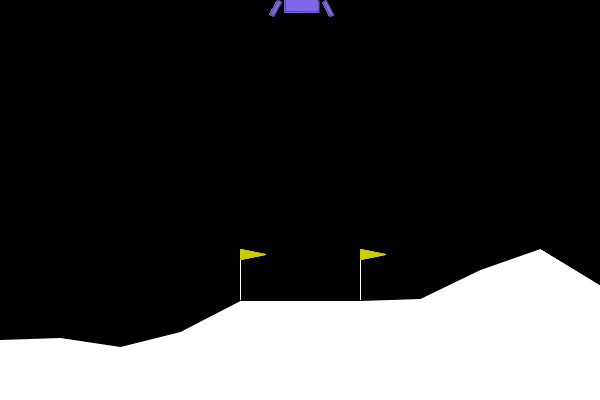
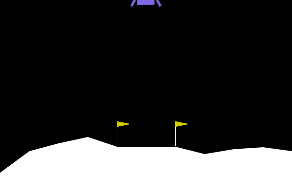
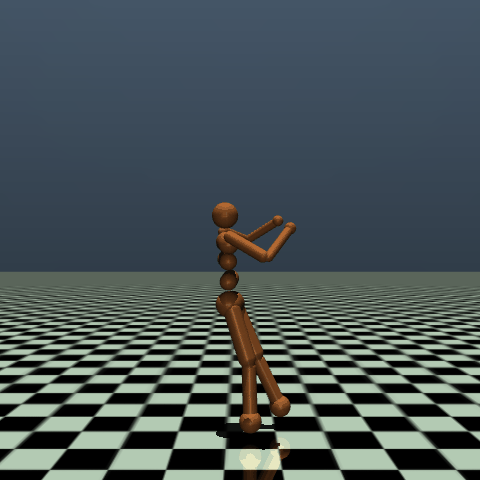

# ECE6882 RL Project 2 — Arante_Andre

PPO-based agents for three Gymnasium environments: CarRacing-v3, LunarLander-v3, and Humanoid-v5.

## Results

| Environment | Testcase 0 | Testcase 1 | Total |
|---|---|---|---|
| CarRacing-v3 | 927.3 | 831.0 | **1758.3** |
| LunarLander-v3 | 264.2 | 180.1 | **444.2** |
| Humanoid-v5 | 6647.2 | 171.2 | **6818.4** |

## Evaluation

```bash
cd CarRacing-v3 && python evaluation.py
cd LunarLander-v3 && python evaluation.py
cd Humanoid && python evaluation.py
```

---

## CarRacing-v3

| Testcase 0 | Testcase 1 |
|---|---|
|  |  |

### Design Decisions

**Action space — discrete over continuous.** We use 5 discrete actions (steer left, steer right, brake, accelerate, noop) rather than the raw continuous Box space. Discrete actions simplify credit assignment and converge significantly faster in practice, reaching eval scores of 900+ vs continuous PPO which struggled to exit negative rewards within the same training budget.

**Observation preprocessing.** Raw RGB frames (96×96×3) are converted to grayscale, cropped to remove the dashboard (96→84 rows), resized to 84×84, normalized to [0, 1], and stacked across 4 consecutive frames. This gives the policy temporal information (velocity, acceleration) without recurrent networks.

**Reward shaping.** Three auxiliary signals are added on top of the native tile-visit reward:
- Speed bonus: `+0.01 × speed / 100` — incentivizes driving fast
- Grass penalty: `−0.1 × (wheels_on_grass / 4)` — penalizes leaving the track
- Smoothness penalty: `−0.02 × |angular_velocity|` — discourages jerky steering

Magnitudes are deliberately small (~10× smaller than the native tile reward of ~3.3) so shaping guides without dominating.

**Early termination.** Episodes terminate if cumulative reward drops below −50, cutting off unrecoverable episodes and improving training efficiency.

**VecNormalize.** Reward normalization (`norm_reward=True`, `clip_reward=10`) stabilizes critic learning across the wide reward range.

**Training.** PPO finetuned from a pretrained checkpoint: `lr=1e-4`, `ent_coef=0.01`, `target_kl=0.02`, `n_steps=512`, `batch_size=256`, `n_epochs=4`.

---

## LunarLander-v3

| Testcase 0 (seed=0) | Testcase 2 (seed=2) |
|---|---|
|  |  |

### Design Decisions

**Algorithm.** PPO with a discrete 4-action space (fire left, fire right, fire main, noop) and a shared MLP actor-critic (64×64 hidden).

**Domain randomization.** Training environments randomize gravity [−11, −9], wind power [10, 20], and turbulence [1.0, 2.0] each episode. This forces the policy to generalize across physics conditions rather than memorizing a single setting, improving robustness on hidden test cases.

**Learning rate schedule.** A linear decay from 1e-4 → 0 over the finetuning run prevents the late-stage performance regression seen with fixed learning rates (the original run peaked at step 1.5M then regressed significantly by 5M).

**Hyperparameters.** `ent_coef=0.005` (reduced from 0.01 for a more deterministic policy), `gamma=0.999` (heavy discounting rewards the landing bonus at episode end), `gae_lambda=0.98`, `target_kl=0.015`.

**Training.** Finetuned from the best saved checkpoint rather than training from scratch.

---

## Humanoid-v5

| Testcase 0 | Testcase 1 |
|---|---|
|  |  |

### Design Decisions

**Algorithm.** PPO with a continuous Gaussian policy, MLP actor-critic (256×256), and VecNormalize for both observation and reward normalization (`clip_obs=10`).

**AwkwardStartWrapper.** Training environments apply randomized pose perturbations at episode start to build recovery robustness:
- Crouch (`z_drop`) up to 0.25m
- Torso tilt (`quat_noise`) up to 0.12 rad
- Joint angle noise up to 0.35 rad
- Velocity noise up to 0.80 m/s
- `awkward_prob` up to 0.85 (85% of episodes start perturbed)

Eval environments use a clean start (no perturbations).

**Stability measures.** A low learning rate (5e-5 with linear decay to 2e-5 in finetuning), `target_kl=0.015`, and `max_grad_norm=0.5` prevent catastrophic policy updates in this high-dimensional control task (348-dim obs, 17-dim action).

**Training.** Initial 10M-step run with `lr=3e-4` → `5e-5` (resume). Finetuning from best checkpoint: `lr=2e-5` (linear decay), `ent_coef=0.003`, `n_epochs=5`.
